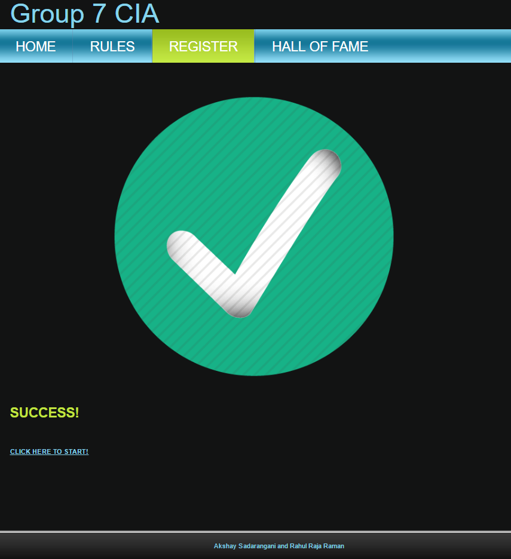
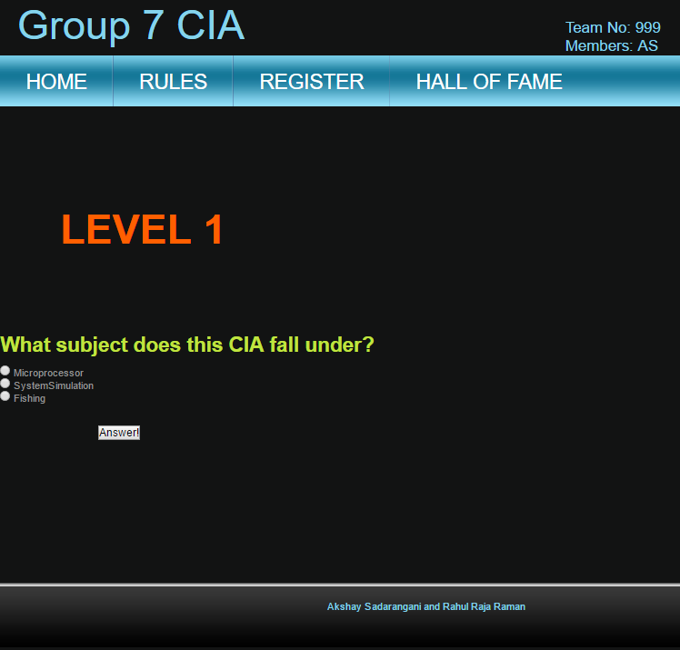
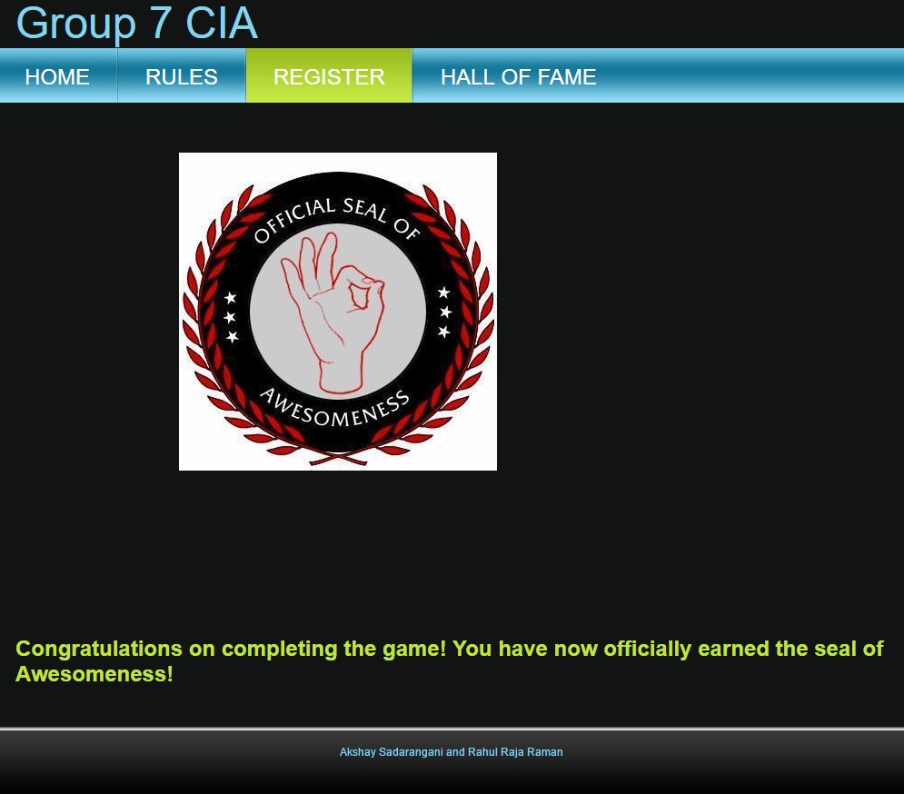

#Computer Architecture Quiz
**_Activity Type: Online Quiz (of sorts, anyway)_**

The activity will be a hybrid of quiz and treasure hunt similar to “Klueless”, the game hosted every year by IIM. Through the activity, students will be required to navigate through a series of webpages tagged by level numbers that increase as they progress. The game will have a total of 21 levels, at the end of which, the first person to have reached the “finish” line is declared the winner.

##Question Format
The game will rely on the user’s interpretation of the question as often as it relies using questions itself. The former target may be achieved by scattering clues across the page as to indicate how the levels should progress. The clues themselves may be in:
-	The title of the page
-	The URL of the page
-	The content on the page (including image name)
-	A portion of the source code that has been commented out

##Setting Up
Open the db_config.php file and set up the database settings. 
> Note: If you are hosting the site locally (e.g. WAMP server), retain the DB_SERVER variable value as `localhost`. Else update the DB_SERVER variable to your host address.

```
<?php
 
/*
 * All database connection variables
 * Enter your database config details here
 */
 
define('DB_USER', "#####"); // db user
define('DB_PASSWORD', "*****"); // db password (mention your db password here)
define('DB_DATABASE', "@@@@"); // database name
define('DB_SERVER', "localhost"); // db server
?>
```

##Usage
- [x] Register for quiz
- [ ] Start the quiz
- [ ] Finish

> Register at /register.html



- [x] Register for quiz
- [x] Start the quiz
- [ ] Finish

> Start the quiz by clicking on start after registration



- [x] Register for quiz
- [x] Start the quiz
- [x] Finish

> At the end of the quiz you will be greeted with the seal of awesomeness



##Bugs and Feedback
For bugs, questions and discussions please use the [Github Issues](https://github.com/aksh4y/IMDb-Rating-Prediction/issues).
